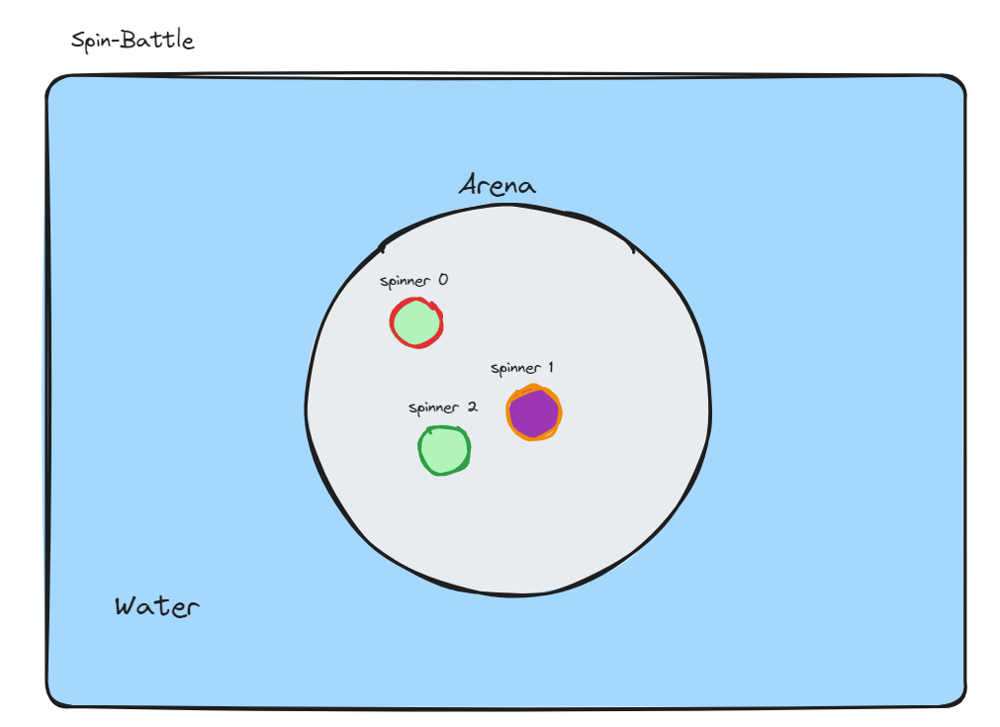

# Functional Specifactaions - Spin Battle

## Document Information

| Property | Value |
| --- | --- |
| Document Title | Functional Specifications - Spin Battle |
| Document Owner | Maxime CARON |
| Creation Date | 2024-03-21 |
| Last Update | 2024-03-21 |

## Overview
This document describes the functional specifications of the Spin Battle game.

### Scope
The Spin Battle game is a 2D game where the player controls a spinning top and must defeat other spinning tops in a battle arena. The game is played in single player mode.

### Inspiration
The game is inspired by the Beyblade series and the Beyblade games.
  
</img>

### Constraints
The game must be developed following the constraints below:
- The game must be developed in C++
- The game must be developed using the SFML library
- The game must be developed using the MVC design pattern
- The game must be developed using the OOP paradigm

## Game Description

### Game Objective
The objective of the game is to defeat all the enemy spinning tops in the battle arena. To do so, the player must use the spinning top to hit the enemy spinning tops and make them fall off the arena.

### Game Mechanics
The game is played in a battle arena. The player controls a spinning top and must defeat the enemy spinning tops. The player can move the spinning top in the arena and make it spin to hit the enemy spinning tops.

### Game Controls
The player can control the spinning top using the following controls:
- W: move the spinning top forward
- S: move the spinning top backward
- A: rotate the spinning top to the left
- D: rotate the spinning top to the right

### Game Visuals
The game will have the following visuals:
  
</img>

## Game Levels
The game will have 3 levels which will be defined by the number of enemy already ejected from the arena. The game will have 3 levels. For each level the arena will be smaller.