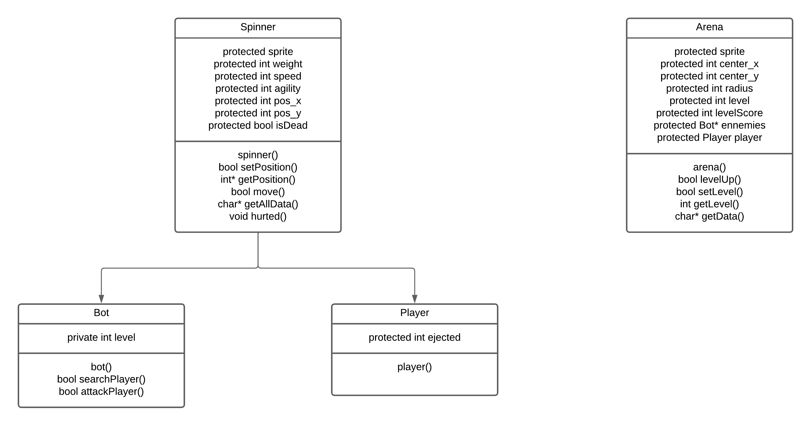
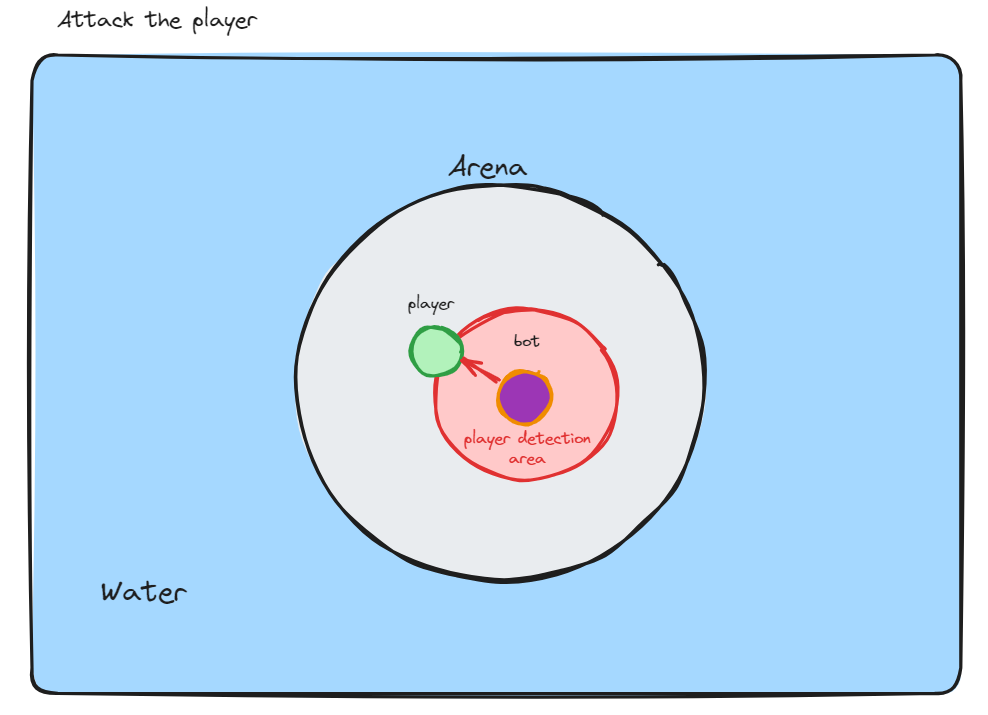
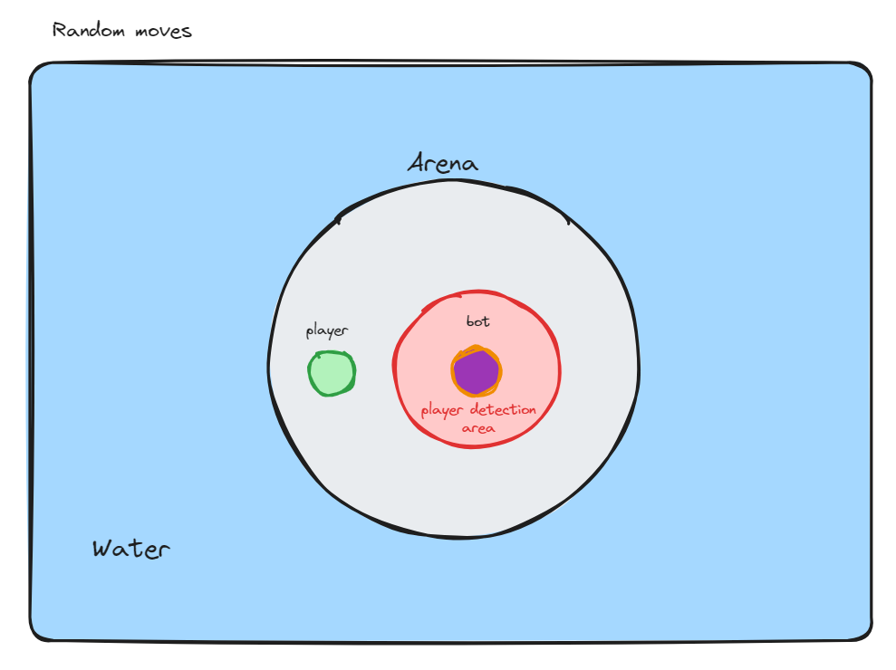

# Technical Specifications - Spin Battle

## Document Information

| Property | Value |
| --- | --- |
| Document Title | Technical Specifications - Spin Battle |
| Document Owner | Maxime CARON |
| Creation Date | 2024-03-21 |
| Last Update | 2024-03-21 |

## Overview
This document describes the technical specifications of the Spin Battle game.

### Game Overview
This game is a 2D game where the player controls a spinning top and must defeat other spinning tops in a battle arena. The game is played in single player mode.

### Constraints
The game must be developed following the constraints below:
- The game must be developed in C++
- The game must be developed using the SFML library
- The game must be developed using the MVC design pattern
- The game must be developed using the OOP paradigm

## Game Architecture

### Design Pattern
The game will be developed using the MVC design pattern. The game will be divided into the following modules:
- Model
- View
- Controller

### Classes
The game will be developed using the following classes:
 
 
</img>

### Tools
The game will be developed using the following tools:
- IDE: Visual Studio Code
- Version Control: Git
- Build System: CMake

### Libraries
The game will be developed using the following libraries:
- SFML: Simple and Fast Multimedia Library
- Standard C++ Library

## Game Physics and AI

### Physics
The game will have the following physics:
- Collision detection
- Inertia

### Ennemy AI
Ennemy spinning tops will have the following behaviors:
- When player is close, move toward the player
  
  </img>

- When player is far, move randomly
  
  </img>
  